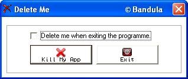



## Method to self\-delete an exe easily

### Description

This is the easiest and simple way of self-deleting an executable. The technique is used even in commercial applications today. Nothing complex, it just uses programming basics plus two APIs to give you the maximum. Wherever your exe exists, it will be self-deleted. (can be perfectly used with Admin privileges.) The technique can be used in your own Uninstall programs.
 
### More Info
 

             |
---                |---
**Submitted On**   |2011-05-20 03:40:06
**By**             |[P\. G\. B\. Prasanna](https://github.com/Planet-Source-Code/PSCIndex/blob/master/ByAuthor/p-g-b-prasanna.md)
**Level**          |Intermediate
**User Rating**    |5.0 (15 globes from 3 users)
**Compatibility**  |VB 6\.0
**Category**       |[Miscellaneous](https://github.com/Planet-Source-Code/PSCIndex/blob/master/ByCategory/miscellaneous__1-1.md)
**World**          |[Visual Basic](https://github.com/Planet-Source-Code/PSCIndex/blob/master/ByWorld/visual-basic.md)
**Archive File**   |[Method\_to\_2204595202011\.zip](https://github.com/Planet-Source-Code/p-g-b-prasanna-method-to-self-delete-an-exe-easily__1-73921/archive/master.zip)

